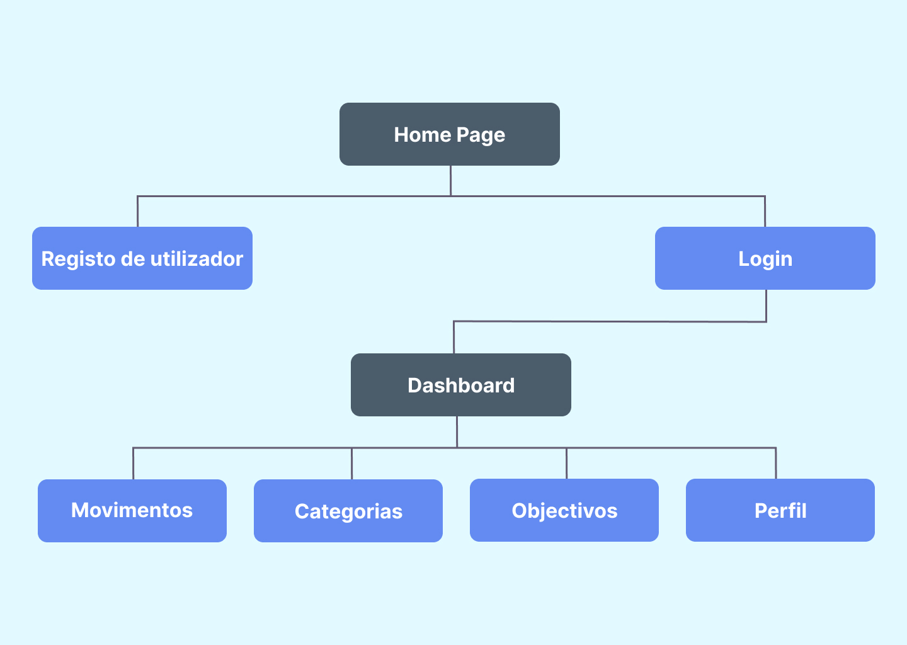
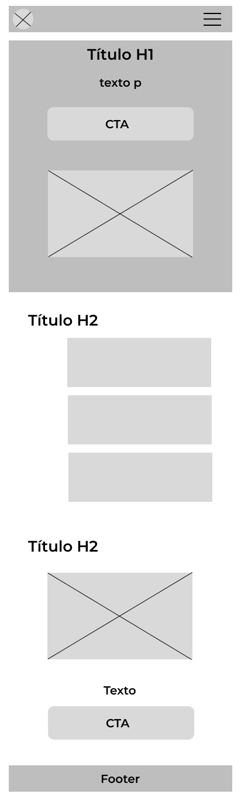
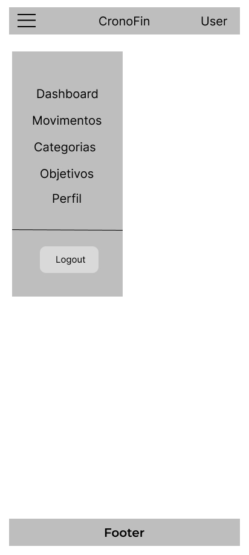
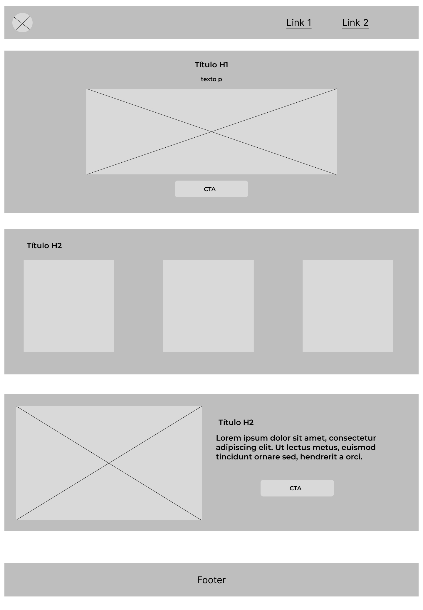
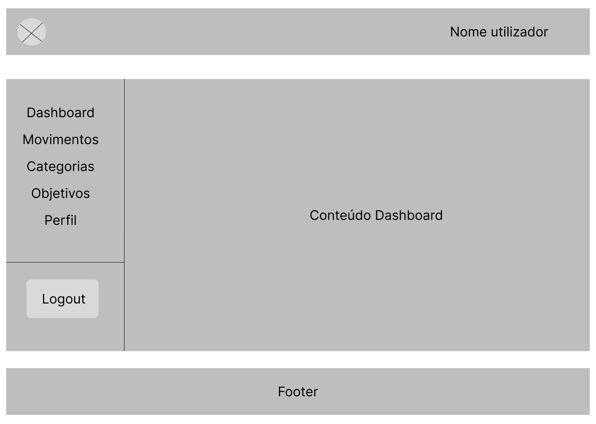
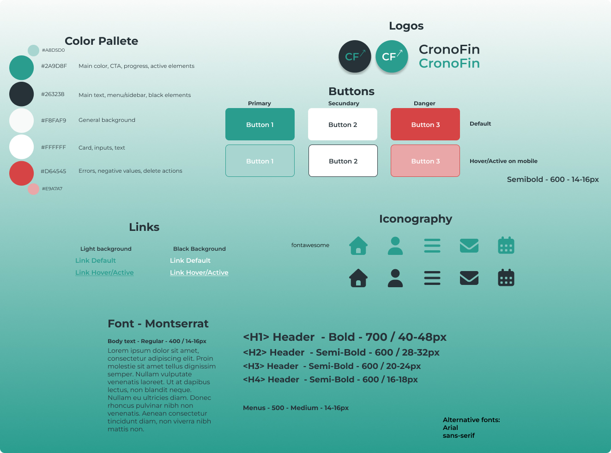
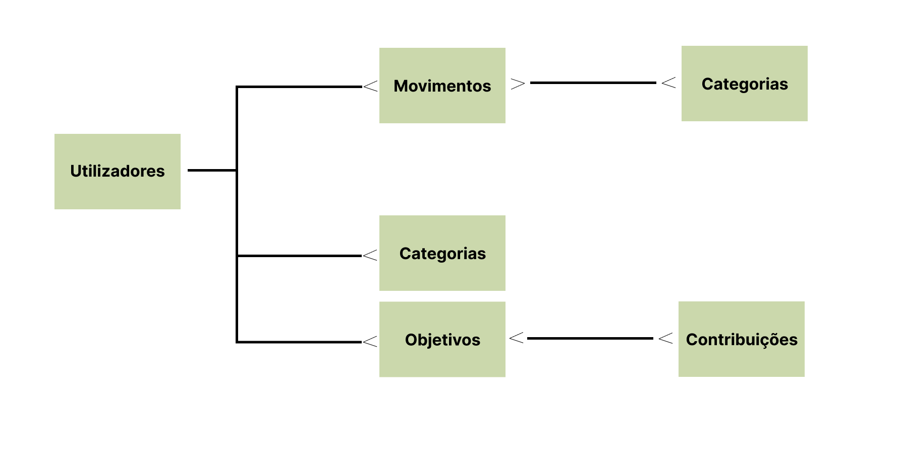
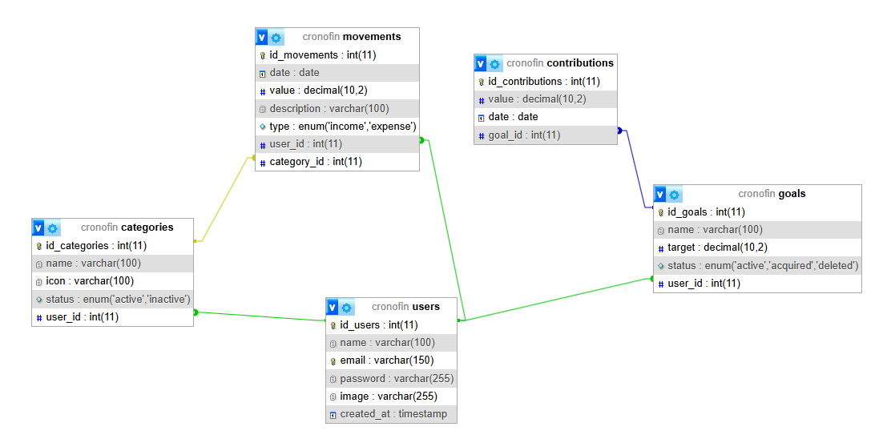

# 📋 Guia de desenvolvimento - Projeto CronoFin

---

## 🌐 Visão Geral

---

- **Tema:** Gestor de finanças pessoais
- **Nome:** CronoFin
- **Finalidade:** Projeto de desenvolvimento pessoal
- **Objetivo:** Criar um projeto que permita, de forma simples, ajudar o utilizador a desenvolver hábitos financeiros saudáveis.
- **Tecnologias:** HTML, CSS, Bootstrap, JavaScript, PHP, MySQL

---

## 🎯 Briefing

---

- **Objetivo do website:** Desenvolver uma aplicação web que permita ao utilizador gerir as suas finanças pessoais, acompanhando o dinheiro que entra e sai através de uma interface simples, intuitiva e orientada para a criação de hábitos financeiros saudáveis.

- **Público-alvo:** Adultos entre os 20 e os 45 anos que pretendem organizar as suas finanças pessoais de forma simples, sem recorrer a aplicações financeiras complexas ou folhas de cálculo.

### Necessidades

- Controlar receitas e despesas;
- Saber para onde vai o dinheiro;
- Poupar para objetivos pessoais;
- Ter uma visão simples da sua situação financeira;
- Substituir o Excel por uma aplicação mais intuitiva.

### Exemplos de utilizadores

- Jovens trabalhadores;
- Casais;
- Estudantes universitários;
- Pessoas que começaram a gerir o seu próprio dinheiro;
- Utilizadores que atualmente recorrem ao Excel.

### Princípios do projeto

- Interface simples e intuitiva;
- Poucos cliques para executar tarefas;
- Informação clara e objetiva;
- Dashboard de fácil leitura;
- Apenas funcionalidades essenciais;
- Navegação simples e consistente;
- Promover hábitos financeiros saudáveis.

### Sites de referência

| Aplicação       | Pontos fortes                                                                                                                                                                                                                     | Pontos fracos                                                                                                                                                                                                  |
| --------------- | --------------------------------------------------------------------------------------------------------------------------------------------------------------------------------------------------------------------------------- | -------------------------------------------------------------------------------------------------------------------------------------------------------------------------------------------------------------- |
| **YNAB**        | - Interface limpa, todos os elementos "respiram";<br>- Exibe a informação mais relevante imediatamente (quanto tenho, quanto posso gastar, quanto já gastei);<br>- Formulários rápidos, com poucos cliques se chega ao resultado. | - Curva de aprendizagem;<br>- Parece uma ferramenta de trabalho, fica muito séria e não transmite sensação de leveza;<br>- Muitas opções e demasiada informação, tornando a utilização menos simples e direta. |
| **Firefly III** | - Excelente estrutura/arquitetura.                                                                                                                                                                                                | - Demasiadas opções, sobretudo para novos utilizadores;<br>- Interface pesada, com muitos textos, tabelas e menus, tendo pouco espaço livre.                                                                   |

### Conclusão da análise

O projeto procurará combinar a simplicidade visual e a boa experiência de utilização do YNAB com uma arquitetura organizada, evitando, no entanto, a complexidade funcional presente em ambas as aplicações.

**O problema:** Muitas aplicações de gestão financeira apresentam um elevado nível de complexidade para utilizadores que apenas pretendem controlar as suas receitas e despesas diárias.

**A solução:** Criar uma aplicação web simples, intuitiva e rápida, que permita ao utilizador acompanhar receitas e despesas sem necessidade de aprender métodos financeiros complexos.

---

## 🗺️ Mapa do site

---



### Área pública

**Página Inicial**  
Objetivo: convencer o utilizador a experimentar a aplicação, comunicando de forma simples os seus benefícios e funcionalidades principais.

- Hero
- Benefícios
- Como funciona
- Screenshots
- Call to Action

**Registo**

**Login**

### Área privada

Restrita a utilizadores com sessão iniciada.

**Dashboard**

- Resumo com saldo atual, receitas, despesas e poupança;
- Gráfico simples de receitas vs. despesas;
- Últimos movimentos.

**Movimentos**

- Pesquisa;
- Tabela com data, categoria, descrição, valor e tipo;
- Adicionar movimento através de formulário.

**Categorias**

- Listar;
- Adicionar;
- Editar;
- Eliminar/desativar;
- Categorias iniciais: alimentação, transporte, casa, lazer e saúde.

**Objetivos**

- Criar novo objetivo;
- Definir nome e valor;
- Adicionar descrição opcional;
- Visualizar progresso através de uma barra de percentagem;
- Adicionar valores poupados ao objetivo.

**Perfil**

- Dados pessoais;
- Alteração de password;
- Preferências;
- Nome, email e fotografia.

**Logout**

---

## ✏️ Design/Wireframes

---

### Versão Mobile

<br>


### Versão Desktop




Foram desenvolvidos wireframes de baixa fidelidade para as duas principais áreas da aplicação: a homepage e o dashboard.

A homepage foi concebida para apresentar a aplicação ao utilizador, destacar os seus principais benefícios e incentivá-lo a criar uma conta para começar a utilizar. Na versão mobile, a principal diferença relativamente à versão desktop prende-se com a reorganização dos elementos numa disposição vertical, proporcionando uma melhor experiência de utilização em ecrãs de menor dimensão.

O dashboard foi concebido com uma estrutura semelhante à utilizada em aplicações como o Gmail, recorrendo a um menu lateral para a navegação entre as diferentes funcionalidades. Na versão desktop, este menu permanece sempre visível, enquanto na versão mobile é substituído por um botão do tipo "hambúrguer", permitindo aproveitar melhor o espaço disponível no ecrã.

---

## 🎨 Identidade visual

---

### Logotipo

Foram desenvolvidas duas versões, para fundos claros e escuros <br>

 <br>


### Moodboard

Quero transmitir:

- [x] Simplicidade – Conseguir entender e utilizar sem ter que aprender a aplicação
- [x] Controlo/organização – Saber para onde está a ir o meu dinheiro
- [x] Progresso/Crescimento – Definir planos de ação que permitam juntar para determinados objetivos


### Style Guide

Como apoio ao desenvolvimento do website, foi criado um Style Guide que define a identidade visual, tipografia, sistema de cores, botões e iconografia, garantindo consistência visual e facilitando a implementação em HTML e CSS.

Estas definições permitem manter uma identidade visual consistente em todas as páginas, contribuindo para um website responsivo, intuitivo e coerente com os objetivos da marca.



---

## 🏗 Estrutura de pastas e ficheiros

```
CronoFin/
├── .gitignore
├── LICENSE
├── README.md                            # Apresentação do projeto
├── project_GUIDE.md                     # Documento teórico do projeto (requisitos, modelo de dados, regras de negócio)
├── docs/
│   └── design/                          # Documentação
│       ├── logos/
│       ├── moodboard_&_styleguide/
│       ├── sitemap_&_er_database/
│       └── wireframes/
├── config/
│   └── database.php                     # Ligação à base de dados (PDO)
├── includes/
    ├── session.php
│   ├── auth.php                         # Verifica se o utilizador tem sessão ativa (proteção de páginas privadas)
│   ├── header.php
│   └── footer.php
├── models/                              # Funções que falam com as respectivas tabelas
│   ├── User.php                         # Tabela `users`
│   ├── Movement.php                     # Tabela `movements`
│   ├── Category.php                     # Tabela `categories`
│   └── Goal.php                         # Tabelas `goals` e `contributions`
├── public/                              # Root
│   ├── index.php                        # Página inicial/pública
│   ├── login.php                        # Página de login
│   ├── register.php                     # Página de registo
│   ├── dashboard.php                    # Página principal após login (resumo/visão geral)
│   ├── movements.php                    # Página com listagem e criação de movimentos (receitas/despesas)
│   ├── goals.php                        # Página com listagem e gestão de objetivos de poupança
│   ├── categories.php                   # Página de gestão das categorias do utilizador
│   ├── profile.php                      # Página com dados e foto do utilizador
│   ├── logout.php
│   └── assets/
│       ├── css/
│       │   ├── base.css                 # Reset, cores globais, tipografia
│       │   ├── layout.css               # Header, footer, estrutura geral das páginas
│       │   ├── components.css           # Botões, cards, formulários (elementos reutilizáveis)
│       │   └── pages/                   # Estilos específicos de cada página
│       │       ├── auth.css             # Eestilos do login/registo
│       │       ├── dashboard.css
│       │       ├── movements.css
│       │       ├── goals.css
│       │       ├── categories.css
│       │       └── profile.css
│       ├── js/
│       │   ├── main.js                  # Lógica comum a todas as páginas
│       │   └── pages/                   # Lógica específica de cada página
│       │       ├── dashboard.js
│       │       ├── movements.js
│       │       ├── goals.js
│       │       └── profile.js
│       ├── img/                         # Imagens fixas do projeto
│       └── uploads/                     # Ficheiros carregados pelos utilizadores
│           ├── profiles/                # Fotos de perfil
│           └── categories/              # Ícones de categorias
└── database/
    └── schema.sql                       # Estrutura da base de dados

```

---

## 📝 Conteúdo das páginas

---

### Homepage

A homepage foi estruturada para apresentar o CronoFin, comunicar os seus principais benefícios e incentivar o utilizador a criar uma conta.

- Header com logotipo e acesso às áreas de autenticação;
- Hero section com proposta de valor e CTA principal;
- Secção de benefícios, focada em controlo, organização e progresso;
- Secção "Começar agora", orientada para conversão;
- Footer com navegação e informação institucional.

### Registo

Página destinada à criação de uma nova conta de utilizador.

- Formulário de registo;
- Criação de conta;
- Acesso posterior à área privada através do login.

### Login

Página destinada à autenticação dos utilizadores.

- Formulário de autenticação;
- Validação das credenciais;
- Acesso à área privada após autenticação.

### Dashboard

O dashboard constitui a área principal da aplicação após o login e foi pensado para permitir ao utilizador consultar e gerir as suas finanças de forma rápida e simples.

**Resumo**

- Indicadores financeiros principais;
- Gráfico de receitas vs. despesas;
- Informação sobre poupança e objetivos.

**Movimentos**

- Consulta, pesquisa e filtragem de receitas e despesas;
- Registo de novos movimentos.

**Objetivos**

- Visualização do progresso através de cards;
- Criação e gestão de objetivos;
- Registo de contribuições;
- Conclusão ou eliminação de objetivos.

**Categorias**

- Gestão das categorias utilizadas nos movimentos;
- Criação, edição e eliminação/desativação de categorias.

**Perfil**

- Consulta e gestão dos dados pessoais;
- Alteração da password.

---

## 🗄️Base de dados & arquitectura

---

### Desenho da base de dados



### Diagrama da base de dados



### Estrutura da base de dados

A aplicação utiliza uma base de dados MySQL composta pelas tabelas `users`, `categories`, `movements`, `goals` e `contributions`.

- **users:** regista os utilizadores e os respetivos dados de autenticação.
- **categories:** armazena as categorias predefinidas do sistema e as categorias criadas pelos utilizadores.
- **movements:** regista as receitas e despesas dos utilizadores, associando cada movimento a uma categoria.
- **goals:** regista os objetivos financeiros definidos pelos utilizadores.
- **contributions:** regista os valores reservados para cada objetivo, mantendo o histórico das contribuições.

### Tabelas

**Tabela users**

- id_users INT AUTO_INCREMENT PRIMARY KEY,
- name VARCHAR(100) NOT NULL,
- email VARCHAR(150) NOT NULL UNIQUE,
- password VARCHAR(255) NOT NULL,
- image VARCHAR(255),
- created_at TIMESTAMP DEFAULT CURRENT_TIMESTAMP

**Tabela categories**

- id_categories INT AUTO_INCREMENT PRIMARY KEY,
- name VARCHAR(100) NOT NULL,
- icon VARCHAR(100),
- status ENUM('active', 'inactive') NOT NULL DEFAULT 'active',
- user_id INT,
- FOREIGN KEY (user_id) REFERENCES users(id_users)

**Tabela movements**

- id_movements INT AUTO_INCREMENT PRIMARY KEY,
- date DATE NOT NULL,
- value DECIMAL(10,2) NOT NULL,
- description VARCHAR(100),
- type ENUM('income', 'expense') NOT NULL,
- user_id INT NOT NULL,
- category_id INT NOT NULL,
- FOREIGN KEY (user_id) REFERENCES users(id_users),
- FOREIGN KEY (category_id) REFERENCES categories(id_categories)

**Tabela goals**

- id_goals INT AUTO_INCREMENT PRIMARY KEY,
- name VARCHAR(100) NOT NULL,
- target DECIMAL(10,2) NOT NULL,
- status ENUM('active', 'acquired', 'deleted') NOT NULL DEFAULT 'active',
- user_id INT NOT NULL,
- FOREIGN KEY (user_id) REFERENCES users(id_users)

**Tabela contributions**

- id_contributions INT AUTO_INCREMENT PRIMARY KEY,
- value DECIMAL(10,2) NOT NULL,
- date DATE NOT NULL,
- goal_id INT NOT NULL,
- FOREIGN KEY (goal_id) REFERENCES goals(id_goals)

### Relações principais

- Um utilizador pode ter vários movimentos (`1:N`).
- Um utilizador pode ter várias categorias (`1:N`).
- Uma categoria pode estar associada a vários movimentos (`1:N`).
- Um utilizador pode ter vários objetivos (`1:N`).
- Um objetivo pode ter várias contribuições (`1:N`).

### Categorias

As categorias podem ser predefinidas pelo sistema ou criadas pelo utilizador.

As categorias predefinidas não estão associadas a um utilizador específico, enquanto as categorias criadas pelo utilizador ficam associadas ao respetivo utilizador.

### Objetivos e contribuições

Os objetivos permitem ao utilizador definir uma meta financeira e acompanhar o valor reservado através de contribuições.

As contribuições pertencem a um objetivo e mantêm o seu próprio histórico. Não representam diretamente uma receita ou despesa.

---

## ⚙️ Regras de negócio

---

### Categorias

As categorias podem ser predefinidas pelo sistema ou criadas pelo utilizador.

- Categorias predefinidas pelo sistema não podem ser eliminadas pelo utilizador.
- Categorias próprias sem movimentos associados podem ser eliminadas.
- Categorias próprias com movimentos associados não são eliminadas, podem apenas ser desativadas.
- Categorias inativas não ficam disponíveis para novos movimentos.
- Categorias inativas podem ser reativadas.

### Movimentos

- Os movimentos representam o dinheiro efetivamente recebido ou gasto pelo utilizador.
- Cada movimento corresponde a uma receita (`income`) ou despesa (`expense`).
- Cada movimento está associado a uma categoria.

### Objetivos e contribuições

- `goals` representam os objetivos financeiros definidos pelo utilizador.
- Um objetivo pode ter várias `contributions`.
- `contributions` representam dinheiro reservado para um objetivo e mantêm um histórico próprio.
- As contribuições não criam movimentos financeiros.

### Gestão dos objetivos

Enquanto um objetivo estiver ativo:

- O utilizador pode alterar a meta.
- A meta não pode ser reduzida para um valor inferior ao valor atualmente reservado.
- O utilizador pode adicionar ou remover poupança através de novos registos em `contributions`.

### Aquisição de um objetivo

Ao definir um objetivo como adquirido:

- É apresentado um formulário para registar a despesa associada.
- O utilizador indica o valor realmente gasto.
- O utilizador pode selecionar uma categoria existente ou criar uma nova.
- A descrição do movimento assume, por defeito, o nome do objetivo.
- O sistema cria um movimento do tipo `expense`.
- Qualquer diferença entre o valor reservado e o valor efetivamente gasto regressa ao saldo disponível.
- O objetivo passa para o estado `acquired`.

### Eliminação de um objetivo

- Ao eliminar um objetivo, o valor atualmente reservado regressa ao saldo disponível.
- O objetivo passa para o estado `deleted`.

---

## 🛠️ Tecnologias e responsabilidades

---

As tecnologias foram escolhidas de acordo com a função que desempenham na aplicação, procurando separar a estrutura, apresentação, interatividade, lógica e armazenamento de dados.

| Tecnologia       | Responsabilidade                                                                             |
| ---------------- | -------------------------------------------------------------------------------------------- |
| **HTML**         | Estrutura e semântica das páginas                                                            |
| **CSS**          | Identidade visual, estilos próprios e personalizações                                        |
| **Bootstrap**    | Grid, responsividade, componentes e utilitários                                              |
| **JavaScript**   | Interatividade no browser, validações e atualizações dinâmicas                               |
| **PHP**          | Lógica da aplicação, autenticação, sessões, operações CRUD e comunicação com a base de dados |
| **MySQL**        | Armazenamento e relacionamento dos dados                                                     |
| **Font Awesome** | Iconografia                                                                                  |

### Organização da interface

A interface será desenvolvida combinando Bootstrap com CSS próprio.

O Bootstrap será utilizado principalmente para:

- Estrutura de layout;
- Grid;
- Responsividade;
- Cards;
- Tabelas;
- Formulários;
- Botões;
- Componentes de navegação.

O CSS próprio será utilizado para:

- Cores e identidade visual;
- Tipografia;
- Espaçamentos específicos;
- Componentes e ajustes personalizados.

### Interatividade

O JavaScript será utilizado quando existir necessidade de interação no lado do cliente, como:

- Validação imediata de formulários;
- Filtros;
- Confirmações de ações;
- Atualização dinâmica de informação;
- Gráficos;
- Pequenas interações da interface.

### Lógica da aplicação

O PHP será responsável pela lógica da aplicação, incluindo:

- Autenticação e sessões;
- Validação dos dados;
- Operações CRUD;
- Comunicação com a base de dados;
- Processamento dos dados antes da apresentação.

---

## 🔒 Segurança

---

A segurança será considerada desde o início do desenvolvimento, principalmente nas áreas de autenticação, validação dos dados e proteção das informações dos utilizadores.

### Validação e proteção de dados

- Validar os dados recebidos pelo servidor;
- Utilizar prepared statements nas consultas à base de dados para evitar SQL Injection;
- Proteger os dados apresentados na página contra XSS.

### Autenticação

- Utilizar sessões para controlar o acesso à área privada;
- Garantir que apenas utilizadores autenticados conseguem aceder aos seus dados;
- As passwords não serão armazenadas em texto simples.

### Acesso aos dados

Cada utilizador deverá apenas conseguir consultar e alterar os seus próprios movimentos, categorias, objetivos e contribuições.

---
